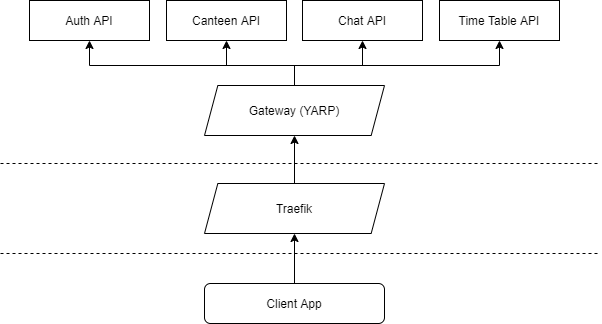

# Unidash Architecture

## Topology
<a name="topology"></a>
Unidash is composed of various microservices within a private service mesh. The gateway project powered by [Microsoft YARP](https://github.com/microsoft/reverse-proxy) that consolidates all services into a single entrypoint. 

For the public facing end of the back-end, we employ Traefik as a reverse proxy. Traefik is in charge of HTTPS, metrics, access logs, load balancing, etc.

The figure below demonstrates the overall topology:



## Service Communication
All services are loosely-coupled and have their own [bounded context](https://codeburst.io/ddd-strategic-patterns-how-to-define-bounded-contexts-2dc70927976e). Where required, services communicate via a message broker with event-based messages. E.g., when an user registers for the first time, an event is emitted and the details then transmitted to the chat API. The chat API receives the message and stores a custom user domain model entry in its database.


##### Further Links
- [MassTransit Manual](https://masstransit-project.com/)

## Patterns
All services use an individual database (it is completely fatal sharing the same database instance across different microservices) where they store their data. Since all microservices differ from their scope and complexity, some of them adhere strict to specific patterns or architectural guidelines than others, where applicable.

For instance, you will spot the repository pattern in some of them, but not necessarily in projects where Entity Framework is in use. EF already provides the required infrastructure and a unit of work layer. Implementing a custom repository pattern would be redundant. 

##### Featured Patterns
- [MVC](https://unidash.top/2019/12/01/foodys-architecture/)
- [Mediator Pattern](https://unidash.top/2020/05/25/the-mediator-pattern-and-cqrs/)
- [CQRS](https://unidash.top/2020/05/25/the-mediator-pattern-and-cqrs/)

### Mediator Pattern
<a name="mediator"></a>
For controller methods, we use the [Mediator Pattern](https://refactoring.guru/design-patterns/mediator) to handle incoming requests. The MediatR NuGet package already provides the building foundation for this pattern. All controller methods should follow this implementation convention:

```cs
// UsersController.cs

/// <summary>
/// Gets a single user based on the user ID extracted from the JWT token.
/// </summary>
/// <returns></returns>
[Authorize]
[HttpGet("@me")]
[ProducesResponseType(typeof(UserResponse), StatusCodes.Status200OK)]
public Task<IActionResult> GetUser() => _mediator.Send(new GetUserRequest());
```

```cs
// GetUserRequest.cs
public class GetUserRequest : IRequest<IActionResult>
{
    public class Handler : IRequestHandler<GetUserRequest, IActionResult>
    {
        private readonly ICurrentUserAccessor _currentUserAccessor;
        private readonly AuthDbContext _authDbContext;
        private readonly IMapper _mapper;

        public Handler(ICurrentUserAccessor currentUserAccessor, AuthDbContext authDbContext,
            IMapper mapper)
        {
            _currentUserAccessor = currentUserAccessor;
            _authDbContext = authDbContext;
            _mapper = mapper;
        }

        public async Task<IActionResult> Handle(GetUserRequest request, CancellationToken cancellationToken)
        {
            var userId = _currentUserAccessor.GetUserId();
            var user = await _authDbContext.Users.FindAsync(userId);

            var response = _mapper.Map<UserResponse>(user);
            return new OkObjectResult(response);
        }
    }
}
```
