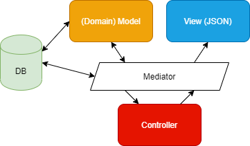

# Software Architecture Document

[[_TOC_]]

## 1. Introduction

### 1.1 Purpose
This document provides a comprehensive architectural overview of the system, using a number of different architectural views to depict different aspects of the system. It is intended to capture and convey the significant architectural decisions which have been made on the system.

### 1.2 Scope
This document provides a broad overview of the technical architecture of the Unidash project.

### 1.3 Definitions, Acronyms and Abbreviations
| Abbrevation | Description                            |
| ----------- | -------------------------------------- |
| API         | Application Programming Interface      |
| MVC         | Model View Controller                  |
| REST        | REpresentational State Transfer        |
| SRS         | Software Requirements Specification    |
| UC          | Use Case                               |
| VCS         | Version Control System                 |
| n/a         | not applicable                         |

### 1.4 References

| Title | Date| Publishing Organization |
| --- |:---:| --- |
| [Architecture Guideline](Architecture.md) | Jun. 28th 2020 | Unidash Team |

### 1.5 Overview
This document contains the architectural representation, goals and constraints as well
as the logical, deployment, Implementation and data views.

## 2. Architectural Representation
### 2.1 Service Mesh
> For an extensive explanation of the **microservices topology**, please refer to [this document](Architecture.md#topology).

### 2.2 MVC
We implement the MVC with the help of the Mediator Pattern. The mediator is responsible for routing the requests to specific handlers. This reduces boilerplate and allows us to adhere to a coherent project structure.

More details about the Mediator Pattern can be [found here](Architecture.md#mediator).

## 3. Architectural Goals and Constraints
We use ASP.NET Core 3.1 as our primary framework for the back-end solution. ASP.NET Core is maintained by Microsoft and already used in many enterprise applications. The overall performance and existing knowledge made us opt into this technology.

The client apps use Ionic, a mobile development framework built on top of Angular.

## 4. Use-Case View
> **TODO**

## 5. Logical View

### 5.1 Overview
The following figure shows a code map of our project with its elements categorized by models, controllers, request handlers and service classes.

### 5.2 Architecturally Significant Design Packages
Reusable elements are implemented in the `Unidash.Core` project to keep our architecture as DRY as possible. It contains logic for the infrastructure, extensions, serivce interfaces and their implementations, utilities, repository classes and much more.

## 6. Process View
> Please refer to the [architecture guide](Architecture.md).

## 7. Deployment View
> Please refer to the [deployment guide](Deployment.md).

## 8. Implementation View
> Please refer to the [architecture guide](Architecture.md).

## 9. Data View
WIP

## 10. Size and Performance
n/a

## 11. Quality/Metrics
We are using Azure Pipelines as a CI/CD platform to ensure high code quality. A new build is always triggered when ever a push to the master or dev branch occurs, or when a pull request is created/updated.

All build results are accessible in the Pipelines section of our Azure DevOps project. 

In addition to that, we also use Sonarcloud for bugs, issues and code smells.
